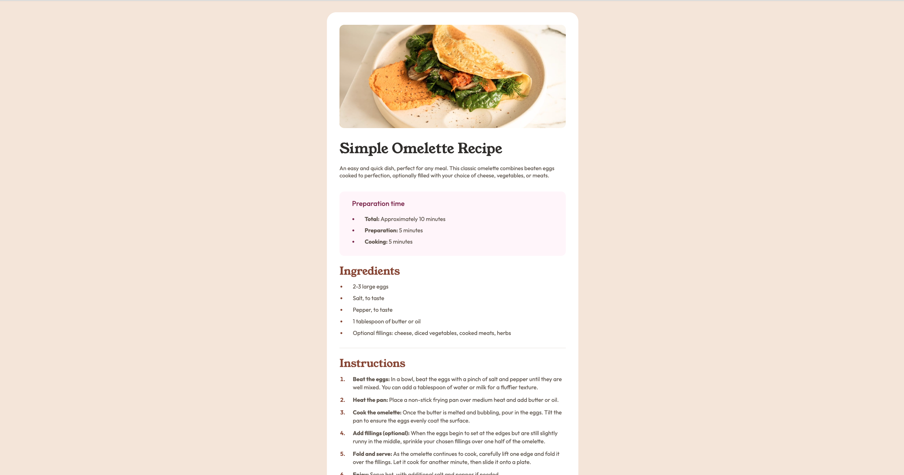

# Frontend Mentor - Recipe page solution

This is a solution to the [Recipe page challenge on Frontend Mentor](https://www.frontendmentor.io/challenges/recipe-page-KiTsR8QQKm). 

## Table of contents

- [Overview](#overview)
  - [The challenge](#the-challenge)
  - [Screenshot](#screenshot)
  - [Links](#links)
- [My process](#my-process)
  - [Built with](#built-with)
- [Author](#author)

## Overview

### Screenshot

### Links

- Solution URL: [Solution](https://github.com/MarwaDawood/FronendMentor_recipe)
- Live Site URL: [Live site](https://frontendmentor-challengesrecipe.netlify.app/)

## My process

### Built with

- Semantic HTML5 markup
- CSS custom properties

## Author

- Website - [Marwa Dawood](https://marwadawood.netlify.app/#)
- Frontend Mentor - [Marwa Dawood](https://www.frontendmentor.io/profile/MarwaDawood)

